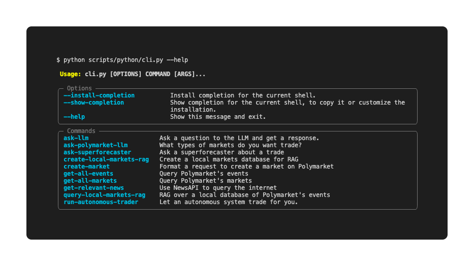

<!-- PROJECT SHIELDS -->
[![Contributors][contributors-shield]][contributors-url]
[![Forks][forks-shield]][forks-url]
[![Stargazers][stars-shield]][stars-url]
[![Issues][issues-shield]][issues-url]
[![MIT License][license-shield]][license-url]


<!-- PROJECT LOGO -->
<br />
<div align="center">
  <a href="https://github.com/polymarket/agents">
    
  </a>

<h3 align="center">Polymarket Agents</h3>

  <p align="center">
    Trade autonomously on Polymarket using AI Agents
    <br />
    <a href="https://github.com/polymarket/agents"><strong>Explore the docs »</strong></a>
    <br />
    <br />
    <a href="https://github.com/polymarket/agents">View Demo</a>
    ·
    <a href="https://github.com/polymarket/agents/issues/new?labels=bug&template=bug-report---.md">Report Bug</a>
    ·
    <a href="https://github.com/polymarket/agents/issues/new?labels=enhancement&template=feature-request---.md">Request Feature</a>
  </p>
</div>


<!-- CONTENT -->
# Polymarket Agents

Polymarket Agents is a developer framework and set of utilities for building AI agents for Polymarket.

This code is free and publicly available under MIT License open source license ([terms of service](#terms-of-service))!

## Features

- Integration with Polymarket API
- AI agent utilities for prediction markets
- Local and remote RAG (Retrieval-Augmented Generation) support
- Data sourcing from betting services, news providers, and web search
- Comphrehensive LLM tools for prompt engineering

# Getting started

This repo targets Python 3.10+ and uses [uv](https://docs.astral.sh/uv/) for dependency management.

1. Clone the repository

   ```
   git clone https://github.com/{username}/polymarket-agents.git
   cd polymarket-agents
   ```

2. Install dependencies with uv (installs into `.venv/` automatically)

   ```
   uv sync
   ```

3. Set up your environment variables:

   - Create a `.env` file in the project root directory

   ```
   cp .env.example .env
   ```

   - Add the following environment variables:

   ```
   POLYGON_WALLET_PRIVATE_KEY=""
   OPENAI_API_KEY=""
   ```

4. Load your wallet with USDC.

5. Try the command line interface...

   ```
   uv run polymarket-agents --help
   ```

   Or just go trade! 

   ```
   uv run polymarket-agents run-autonomous-trader
   ```

6. If running with docker is preferred, we provide the following scripts:

   ```
 ./scripts/bash/build-docker.sh
 ./scripts/bash/run-docker-dev.sh
  ```

7. (Optional) Install git hooks to keep formatting consistent:

   ```
   uv run pre-commit install
   ```

## Logging

The helper in `polymarket_agents.utils.logging` provides three levels with color-coded output:

- `log_print(...)`: user-facing information (default level).
- `log_debug(...)`: diagnostic messages hidden unless `POLYMARKET_LOGGING=1`.
- `log_error(...)`: always shown, emitted to stderr.

Control verbosity with the numeric `POLYMARKET_LOGGING` environment variable (default `0`, add it to `.env` or export it before running). Higher numbers include all lower levels:

- `POLYMARKET_LOGGING=0`: show user-facing logs (print + errors).
- `POLYMARKET_LOGGING=1`: include diagnostic output (debug + print + errors).

You can also adjust verbosity in code while the process is running:

```python
from polymarket_agents.utils import enable_logging, set_log_level

enable_logging(True)        # toggle non-error logs
set_log_level("debug")      # one of: debug, print, error
```

## Architecture in 5 Minutes

```
src/polymarket_agents
├── cli/            # Typer commands and CLI bootstrapping
├── application/    # High-level agent workflows and orchestrators
├── connectors/     # Integrations (Polymarket, News API, vector stores)
├── polymarket/     # Trading logic, order utils, blockchain clients
├── api/            # HTTP surfaces for external control and callbacks
├── settings/       # Environment and configuration helpers
└── utils/          # Shared logging, prompts, and helper utilities
```

- The CLI is defined in `cli/main.py` and surfaces commands such as `get-all-markets` and `run-autonomous-trader`. Each command calls into orchestrators in `application/`. See `src/polymarket_agents/cli/README.md` for a map of available entry points.
- Connectors encapsulate external services. `connectors/README.md` highlights the Polymarket client, Chromadb RAG integration, and news ingestion flow.
- Domain models and trade execution live under `polymarket/`, while `api/` provides FastAPI routes for remote control. Both modules rely on typed Pydantic objects and reusable request helpers.
- Configuration is centralized in `settings/`, which loads `.env` files and prepares runtime settings; downstream modules depend on these helpers instead of touching `os.environ` directly.
- Scripts in `scripts/` wrap Docker builds, local dev startup, and CI-friendly runners. The `docs/` directory collects longer-form explanations and operational runbooks.

# Contributing

If you would like to contribute to this project, please follow these steps:

1. Fork the repository.
2. Create a new branch.
3. Make your changes.
4. Submit a pull request.

Please run pre-commit hooks before making contributions. To initialize them:

   ```
   pre-commit install
   ```

# Related Repos

- [py-clob-client](https://github.com/Polymarket/py-clob-client): Python client for the Polymarket CLOB
- [python-order-utils](https://github.com/Polymarket/python-order-utils): Python utilities to generate and sign orders from Polymarket's CLOB
- [Polymarket CLOB client](https://github.com/Polymarket/clob-client): Typescript client for Polymarket CLOB
- [Langchain](https://github.com/langchain-ai/langchain): Utility for building context-aware reasoning applications
- [Chroma](https://docs.trychroma.com/getting-started): Chroma is an AI-native open-source vector database

# Prediction markets reading

- Prediction Markets: Bottlenecks and the Next Major Unlocks, Mikey 0x: https://mirror.xyz/1kx.eth/jnQhA56Kx9p3RODKiGzqzHGGEODpbskivUUNdd7hwh0
- The promise and challenges of crypto + AI applications, Vitalik Buterin: https://vitalik.eth.limo/general/2024/01/30/cryptoai.html
- Superforecasting: How to Upgrade Your Company's Judgement, Schoemaker and Tetlock: https://hbr.org/2016/05/superforecasting-how-to-upgrade-your-companys-judgment

# License

This project is licensed under the MIT License. See the [LICENSE](https://github.com/Polymarket/agents/blob/main/LICENSE.md) file for details.

# Contact

For any questions or inquiries, please contact liam@polymarket.com or reach out at www.greenestreet.xyz

Enjoy using the CLI application! If you encounter any issues, feel free to open an issue on the repository.

# Terms of Service

[Terms of Service](https://polymarket.com/tos) prohibit US persons and persons from certain other jurisdictions from trading on Polymarket (via UI & API and including agents developed by persons in restricted jurisdictions), although data and information is viewable globally.


<!-- LINKS -->
[contributors-shield]: https://img.shields.io/github/contributors/polymarket/agents?style=for-the-badge
[contributors-url]: https://github.com/polymarket/agents/graphs/contributors
[forks-shield]: https://img.shields.io/github/forks/polymarket/agents?style=for-the-badge
[forks-url]: https://github.com/polymarket/agents/network/members
[stars-shield]: https://img.shields.io/github/stars/polymarket/agents?style=for-the-badge
[stars-url]: https://github.com/polymarket/agents/stargazers
[issues-shield]: https://img.shields.io/github/issues/polymarket/agents?style=for-the-badge
[issues-url]: https://github.com/polymarket/agents/issues
[license-shield]: https://img.shields.io/github/license/polymarket/agents?style=for-the-badge
[license-url]: https://github.com/polymarket/agents/blob/master/LICENSE.md
